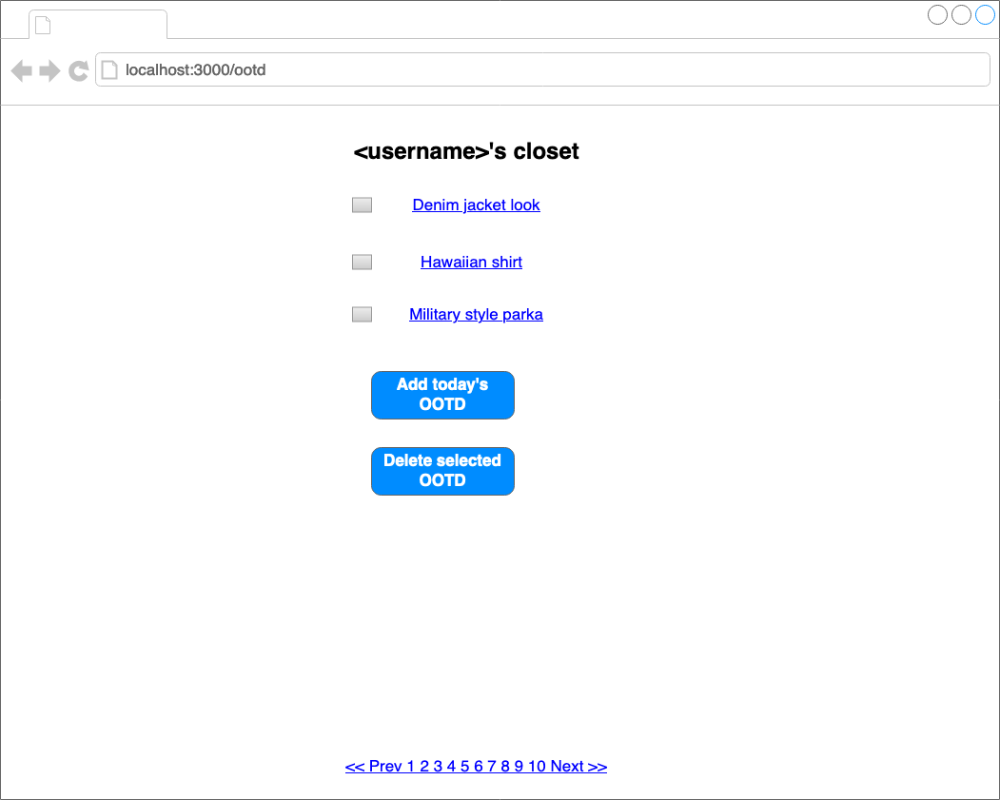
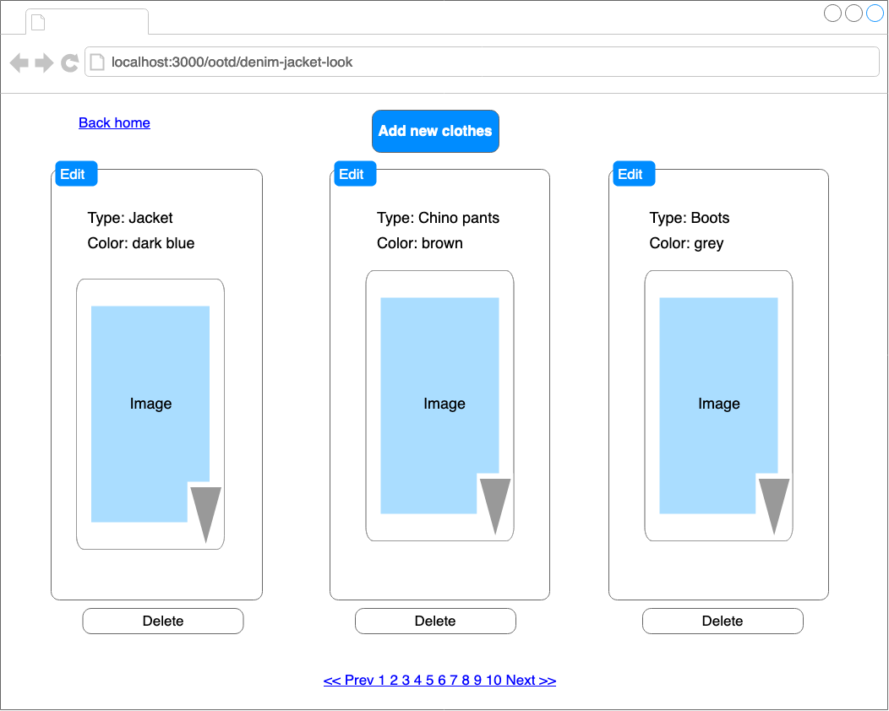
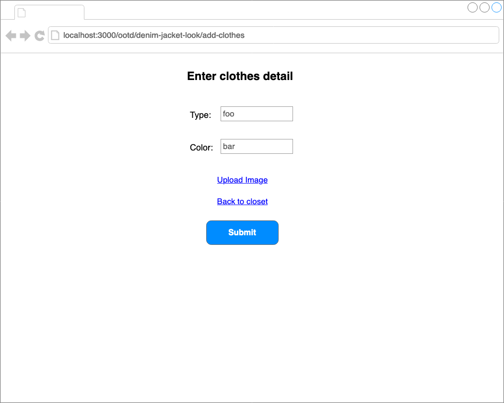
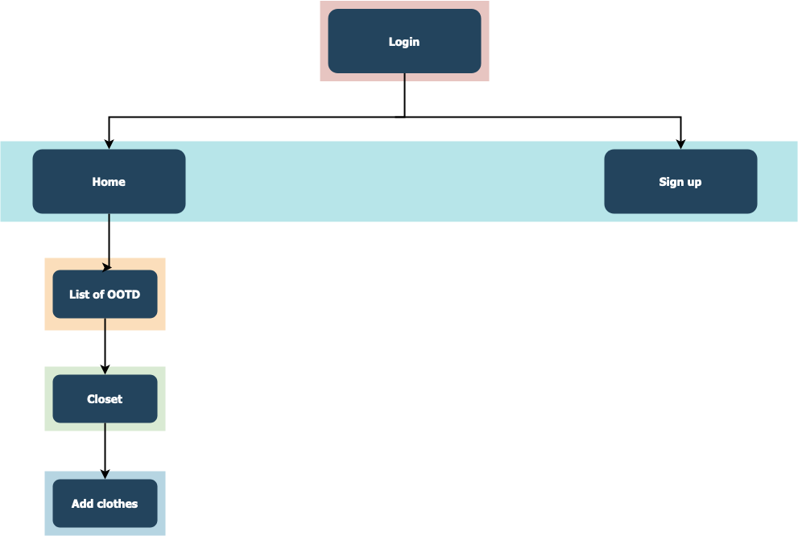

# Closattire

## Overview

Trouble in picking out clothing? Difficult in matching colors? Looking for a closet to hang your best outfits? Everyone deserves to be in their best look. Every now and then, we come across that day exceptionally liking our OOTD. Don't we want to remember the harmony of garments with glory? Closattire will be at your service.

Closattire is an online web application where users can save their outfit information. First-time users must sign up to use the app. Once users are logged in, they will be directed to the homepage presenting a list of custom nicknames for the saved OOTD. They are able to create, delete, and modify the list stored in their accounts. When saving their OOTD, users will be asked to enter the type of clothing (eg. Shirt, Shoes, etc.), the color of the clothes, and a picture of the clothes.

## Data Model

The application will store Users, OOTD and Clothes

-   users can have multiple ootd (via references)
-   each ootd can have multiple clothes (by embedding)

An Example User:

```javascript
{
  username: "user1",
  hash: // a password hash,
  ootd: // an array of references to List documents
}
```

An Example List with Embedded Clothes:

```javascript
{
  user: // a reference to a User object
  name: "Rocket the Denim Jacket",
  items: [
    { type: "chino pants", color: "brown", img: "uniqueID-filename"},
    { type: "denim jacket", color: "dark blue", img: "abc-denim.jpg"},
    // hat, glasses, etc.
  ],
  createdAt: // timestamp
}
```

## [Link to Commented First Draft Schema](db.js)

(**TODO**: create a first draft of your Schemas in db.js and link to it\_)

## Wireframes

localhost:3000 - Sign in page


/ootd - Page for showing all saved OOTD



/ootd/name-of-ootd - Page for showing pieces of outfit



/ootd/name-of-ootd/add-clothes - Page for adding new clothes to ootd



## Site map



## User Stories

1. As non-registered user, I can register a new account with the site.
2. As a user, I can log in to the site.
3. As a user, I can create a new OOTD data.
4. As a user, I can view all of the OOTD lists I've created in a single list.
5. As a user, I can modify clothes or photo in an existing OOTD information.
6. As a user, I can delete existing OOTD lists.
7. As a user, I can assign mood score, scale of 1 to 100, to OOTD lists.

## Research Topics

-   (3 points) Unit testing with JavaScript
    -   Perform minimum of 4 unit testings.
    -   Using Mocha and Chai
-   (3 points) Perform client side form validation using custom JavaScript or JavaScript library
    -   Unacceptable image format will show an error message
-   (1 - 6 points) Use a server-side JavaScript library or module that we did not cover in class (not including any from other requirements)
    -   Modules are TBD
-   (1 - 6 points) Use a client-side JavaScript library or module that we did not cover in class (not including any from other requirements)
    -   Modules are TBD

At least 8 points total out of 8 required points.

## [Link to Initial Main Project File](app.js)

(**TODO**: create a skeleton Express application with a package.json, app.js, views folder, etc. ... and link to your initial app.js\_)

## Annotations / References Used

(**TODO**: list any tutorials/references/etc. that you've based your code off of\_)

1. [passport.js authentication docs](http://passportjs.org/docs) - (add link to source code that was based on this)
2. [tutorial on vue.js](https://vuejs.org/v2/guide/) - (add link to source code that was based on this)
